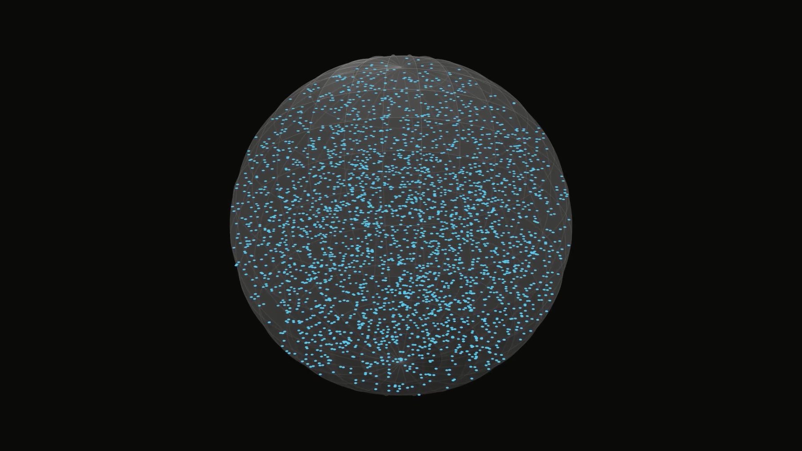

# How to Find a Random Point in a High Dimensional Ball

This is my video project for the [Summer of Math Exposition 2 (SoME2)](https://summerofmathexposition.substack.com/p/the-summer-of-math-exposition-is) competition hosted by [3Blue1Brown](https://www.youtube.com/c/3blue1brown).

This project was inspired by Justin's video, ["The BEST Way to Find a Random Point in a Circle"](https://www.youtube.com/watch?v=4y_nmpv-9lI), which was one of the honorable mentions in last year's Summer of Math Exposition competition. It was also inspired by two of the courses that I took at Cornell: CS 4850 and MATH 2240. In this project, I extended Justin's results and discussed how to find a uniform random point in a high-dimensional ball.

This GitHub repo contains my script in LaTeX, my Manim code for the animations, and my Jupyter notebook code for the simulations.

You can watch my video on YouTube [here](https://www.youtube.com/watch?v=IhhJTwqGH_I).
